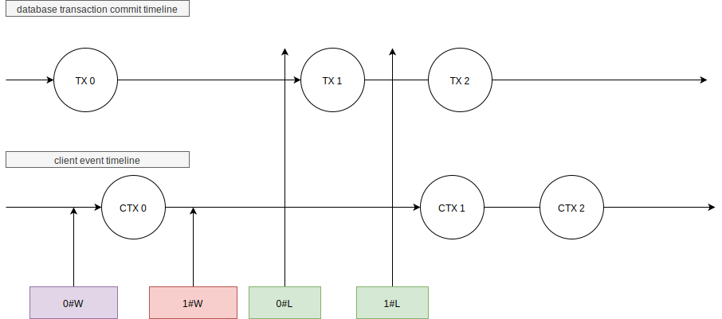

list-watch details
---

## Update Object
There is a column named version in the object table schema which indicates the object's version.

When we want to update the meta value of an object, we should execute such SQL:
```mysql
begin; /** means these SQL should be executed in one transaction. */
update object set update_time = ? and version = ? where id = ? and version < ?;
update object_meta_value set value = ? 
where object_id = ? and meta_id = ?;
```

This mechanism ensures that the version of the object increases monotonically.
## List-Watch


In order to illustrate the mechanism of list-watch synchronization, we have defined the following functions.

Suppose n and m are two transactions, n happens before m.

- TX(n) : The time point when transaction n was committed.
- CTX(n) :  The time point when  database changed events received by the client.


We have:

1. TX(n) < TX(m)
2. CTX(n) < CTX(m)
3. TX(n) < CTX(n)

When we want to list-watch the objects, we have two steps:

- Firstly, we start to listen  database change events at time_0.
- Secondly, we fetch data at time_1.

Now we have `time_1 > time_0`.
Suppose n is the last transaction before we fetch data from the database, we have ` TX(n+1)  > time_1 > TX(n) `.
Then we have  `TX(n+1) > time_0`;
Which means, client will observe all events happened after n.
Client can still observe the events that happen before n.

It's ok.

We only have three types of event here:

1. update
2. create
3. delete

If the event's type is `update`, we just apply the changes only if the event's object version is bigger than the current object's version.

If the event's type is `create` and the memory object already exist, we drop that event, otherwise we append it to the object's list in memory.

If the event's type is `delete` and we have that object, we remove it from the object's list in memory. If we don't have it, we drop the event.